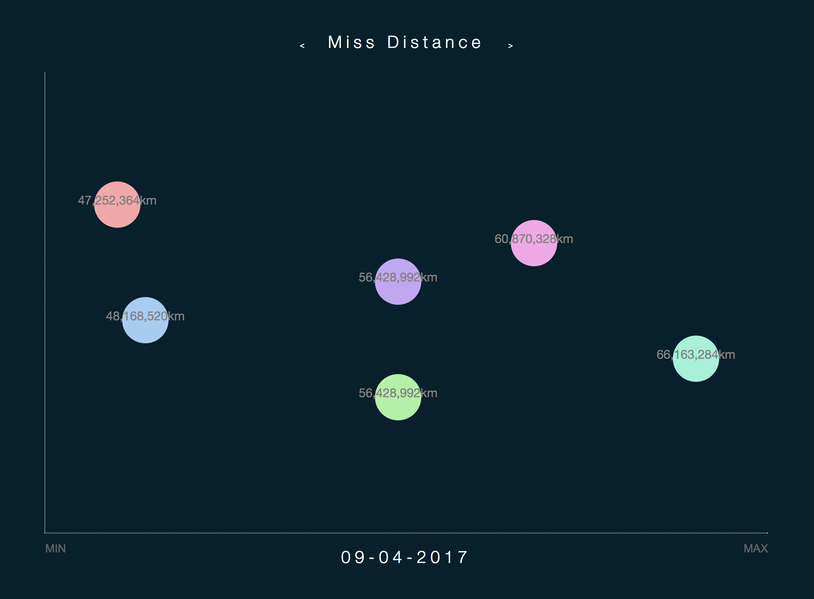

# Nearest Asteroids Elm

## Synopsis

See live preview [here](https://njsfield.github.io/Nearest-Asteroids-Elm/)

This app accesses NASA’s NeoWS API to retrieve nearest asteroids from earth based on today’s (or nearest days) data.

## Install

To get running locally:

+ `npm install` to install node modules
+ `npm run elm-install` to install elm packages
+ `npm run watch` to build the `css`, compile the `elm` to `js`, run the dev server and watch for changes

(you can also run `npm run watch:css` and `npm run watch:elm` separately to watch for changes in `css` or `elm` code)
